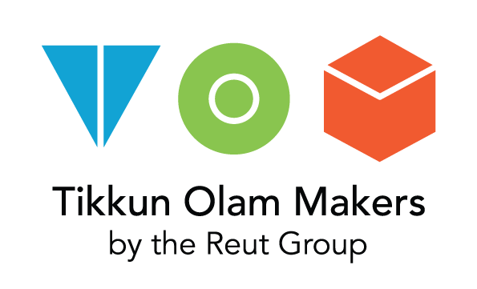

TOM:Tikkun Olam Makers is a global movement bringing together people with disabilities and Makers to develop open source assistive technology to address everyday challenges.

Welcome to the Book of TOM, you signed up to host a TOM Makeathon in your community and are ready to start planning. These guidelines will help you to delve deeply into planning your event, understanding roles, setting up the schedule and creating the TOM atmosphere. We will give you all the tools to plan an authentic TOM Makeathon and encourage you to incorporate local flair and flavor into the event.

We want you to DREAM BIG!

Our team is here to guide you throughout the entire planning process, if you have any ideas for your event that deviate from the TOM guidelines, give your point of contact a call and we’ll help you make your dreams come true.	

